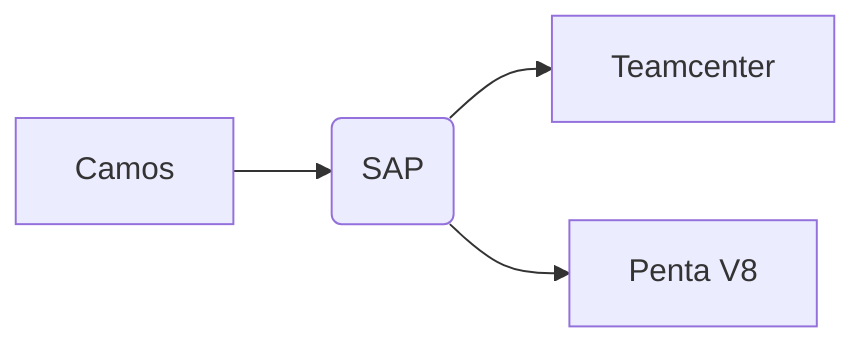
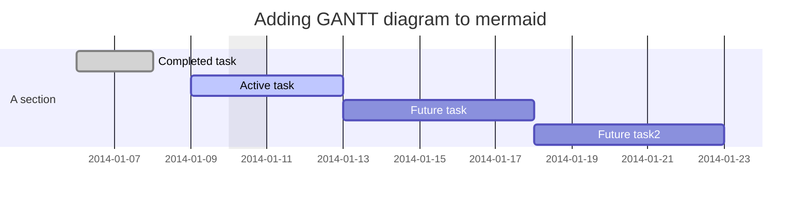

# EISENMANN Shanghai

## Teamcenter

Deployment  

1. Storage  
   * Volume  
     * Windows  
     * Linux  
   * Database  
     * Oracle  
     * MS SQL Server  
2. Modeling  
3. Protection  
4. Configuration  
5. Productivity  

***

ZPRD: production / product material

ZKON: construction assembly  

ZHAW: purchased part

ZROH: raw material

ENAP: Eisenmann Auxiliary material

ZLTV  

ZLTA

ZLTS

Z: not SAP standard

T: Teile (Parts)

L: Liste (List)

V: Vorabbeschaffung (Advance procurement / pre order)

A: Auftrag (Order / Project)

S: Service

### Teamcenter 8 -> Penta V8  

## ERP  

### SAP

* ECC ERP Central Component  
* S/4HANA  

PS: Project Structure  

SD: Sales Distribution  

